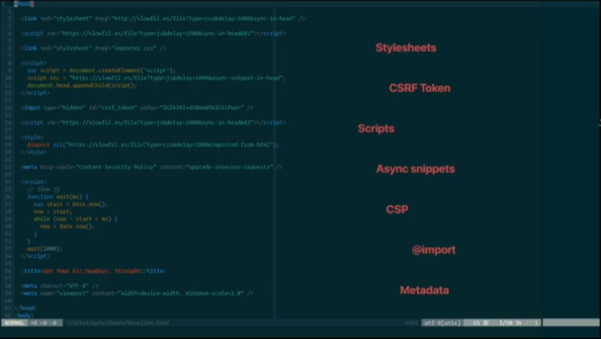
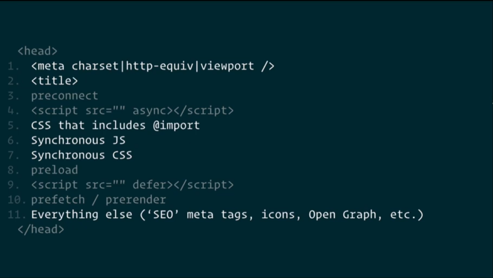

# Get Your `<head> ` straight

> By: [Harry Roberts](https://beyondtellerrand.com/events/dusseldorf-2021/speakers/harry-roberts)
>
> **Video:** https://www.youtube.com/watch?v=MHyAOZ45vnU 

- Anecdote: The Egyptians thought the heart was the most important organ in the
  body, more important than the brain.
- Anecdote II: The cephalocentric theory put the emphasis on the brain rather
  than the heart but didn't gain popularity until recently.
- It seems like nearly every dev subscribes to the cardiocentric theory, they
  put the emphasis in the body rather than head.
- The head is in fact far more important than the body in term of webpage
  optimization

**Key Concepts**

1. HTML is parsed line by line.
1. The head is the single biggest render-blocking part of the document. The body
   is never discovered until the head finishes parsing.

   **Example**: trying to load a script synchronously within the head defers the
   rendering of the body.

## Baseline

The head in the screenshot above takes 9.33s to parse, until first render.

### TIP #1: If you can get it out the head, DO SO!

- Low-prio scripts should move to the body
- Redirects are expensive (third party cdn are considered redirects)
- Reduce payload size (don't use all of bootstrap / lodash, use only what you
  need)

### TIP #2: Self host whatever you can

- Using somebody else's infra can come at big costs (Saves ~0.4ms per req)

### TIP #3: Get your head checked out

- Validate your HTML! Invalid head tags costs some body rendering time.
- Putting tags like input terminated the head early, and causes the DOM to start
  rendering.
- Turns out that actually slowed down the page :(, but it's still important to
  ensure everything in your head actually parses

## The Optimum Order

### TIP #4: Meta CSP disables the preload scanner

- **Preload scanner**: Invented in IE8 as the "speculative pre-parser", it makes
  browsers much faster by decoupling resource discovery from processing.
- This issue is very rare
- If the browser sees this meta after requesting resources, it will re-request
  them
- Just moving this meta to the top of the head saves us ~3s!

### TIP #5: Metadata about the page always goes FIRST!

- The browser re-parses the entire page once it meets the char encoding meta
  tag.
- It also re-renders the whole page once it meets the meta viewport tag.

### TIP #6: Don't hide the title

- The title should not be included after the scripts
- if it is, the title is only rendered after scripts and styles are parsed.

### TIP #7: Synchronous JS should go before CSS!

- CSS blocks JS parsing: The browser defensively waits for CSS to render first
  in case a script will make a CSS query.
- This is really important if your script makes any requests.
- In Chromium: Sync JS blocks CSS `@import` (Try to avoid @import anyway)
- Saves ~1.6 seconds from the rendering of the page above
- Removing css `@import` saves ~0.75s

### TIP #8: SEO and Social Goes Last

- If Google bot can't find your meta tags, it can't find your content either.

## A New Order

After the change, the page takes only ~2.66s FCP, this new optimal order is:

0. Meta CSP (Content-Security-Policy)
0. Meta charset
0. Meta viewport
0. Title
0. Synchronous JS
0. CSS (without `@import`)
0. Social and Other Meta Tags

## A CT Scan for your web page

- `https://csswizardry.com/ct/ct.css` A little CSS script written by the
  presenter to identify issues that may be in your `<head>`.