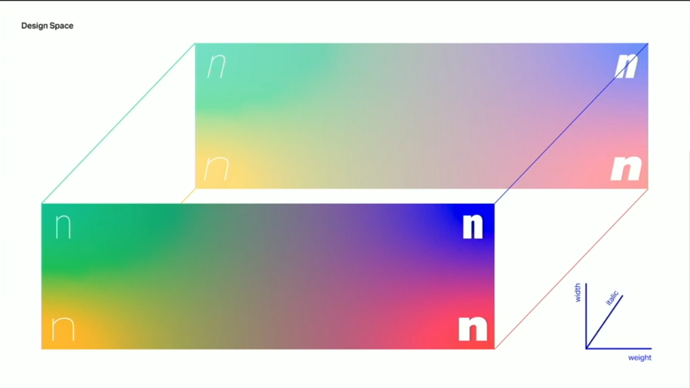

# VFWTF? - Variable Fonts WTF?

> By: [Bianca Berning](https://beyondtellerrand.com/events/dusseldorf-2021/speakers/bianca-berning)
>
> **Video:** https://www.youtube.com/watch?v=yBSbHaOlYrk

- Take a look at where we are in terms of Variable Fonts

## The Rundown

- When you design a website, you need mitigate the amount of time it takes to
  load fonts.

- We normally serve fonts with one file per font weight / variant.
- The biggest amount of data per fount is the information about the outline of
  each glyph.
- It seems that in each file, we always describe the same nodes. 
- Instead of describing the nodes a new for each weight / variation, we can
  simply attach different coord values to each node, which makes [variable
  fonts](https://developer.mozilla.org/en-US/docs/Web/CSS/CSS_Fonts/Variable_Fonts_Guide).
- Variable fonts saves the amount of requests as well as file size.

## Axes

- When choosing fonts, we can always imagine a 3d pallette where each axis
  represents a dimension of the type: X: Weight, Y: Width, Z: Slant
- In a Working Group to define the Variable fonts specification, there were
  actually 5 Axes that were considered as variables to define the font.
- In addition to the 3 mentioned above, there is also an Italic boolean, which
  also determines the style of the glyphs themselves (in addition to the slant)
- The optical size axis determines the size of the hairline elements in a glyph,
  to balance out width and weight in smaller sizes.
- Custom axes allow you define additional variables to control fonts, however
  they might not be supported by all browsers.

## Application support

- Currently variable fonts are only supported in Sketch, Photoshop and inDesign.
  But browser support is much better, that is everyone besides IE11.
- Include woff or even better woff2 files for variable fonts.
- The font's variables can be defined by implementers using the
  `font-variation-settings` css property.

## Costs

- How to price VF? Should we pay / charge for one font? Should we pay / charge
  for a whole font family? The answer is probably somewhere in the middle.
- We can use that Design space model from above to define the Axes that are
  required, and price the fonts accordingly.
- So far though there is no consensus on how to price Variable Fonts just yet.

## Inspiration

Some cool axes to be inspired by:

- Dark Mode: plays on the optical size axis to bold the font between modes
- [Responsivity](https://codepen.io/belluzj/pen/qBXYYBd): Use the width axis to
  be able to play with width that corresponds to viewport width
- Wide Angle: Manipulate the width access according to view angle to improve
  legibility. Can work great in AR and gaming applications.
- Design Systems: Use one variable font for the design system, and still get
  typographic variations by applying design token values.
- Live Data Represention: Use type to illustrate data variations. 

## See Also

www.variablefonts.org

## Questions

Q: Accessibility and readability were not mentioned in the talk. What is the
   plan for accesibility? A: I think the basis of accessibility needs to be
   within the font's design. A lot of research is being done into how to
   incorporate this in Variable fonts, but the results are inconclusive so far.
   This does have a good way forward in enabling users to choose their own level
   of legibility, using variable fonts.
